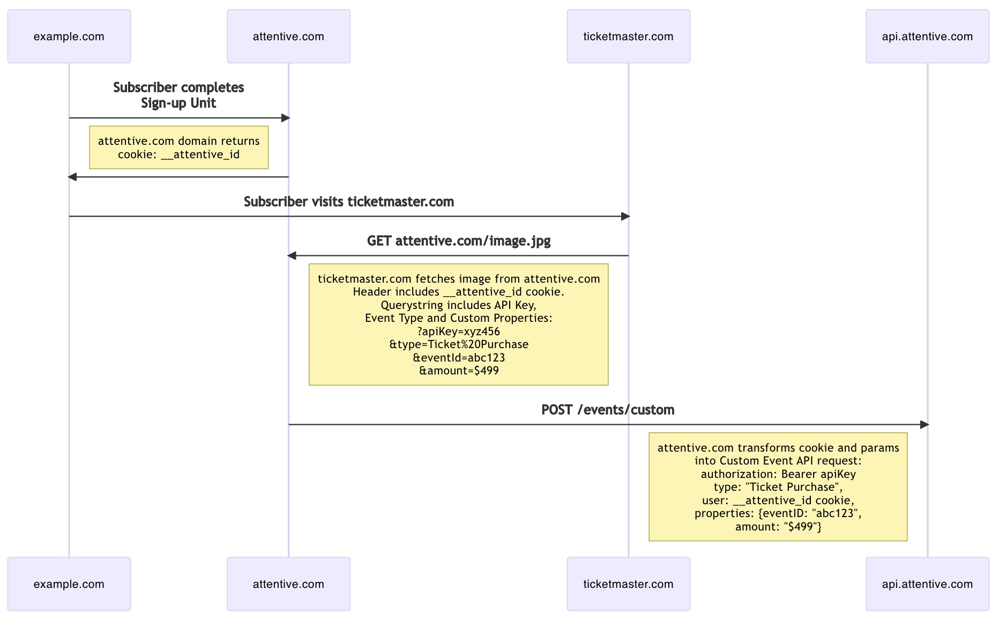

# Attentive Ticketmaster Proxy
 
Proxy server that receives GET requests at `/ticketmaster/:apiKey`, transforms the query params into data object properties and reroutes the request to Attentive Custom Events API server at `https://api.attentivemobile.com/v1/events/custom` as an authenticated POST request.

## Installation

Requires Node.js. To install dependencies type:

```shell
npm install
```

## Run it

Uses `nodemon` to automatically reboot server as you make/save changes. To run the server type:

```shell
npm run dev
```

## Ticketmaster params

Many companies use Ticketmaster to sell tickets to events and want to track the source of a ticket referral for attribution. Ticketmaster does not allow you to add third-party javascript tags but it does allow you to perform *pixel tracking* by including an `img` tag that performs a GET request with custom parameters attached. A cookie for identifying the subscriber can be set by the attn.tv domain during the sign-up process and this cookie would be sent by the browser when fetching the image from the attn.tv domain. This cookie and the params can be used to extract event data and properties and rerouted to the Attentive API as an authenticated POST request.

## Flow

An `__attentive_id` cookie will be created by the `attn.tv` domain during the sign-up unit process. When `ticketmaster.com` fetches an image from the `attn.tv` domain the cookies belonging to that domain will be passed in the header of the GET request when requesting the image. The `attn.tv` server can use inspect the cookie to determine the user and transform the request into a Custom Events API request.



## curl examples

For example, when fetching an image from ticketmaster.com from attn.tv, the GET request could be constructed like this:

```shell
curl 'https://attn.tv/image.jpg?apiKey=xyz456&type=Ticket%20Purchase&eventId=abc123&amount=$499' \
-b "__attentive_id=def789"
```

<!-- 
curl 'localhost:4000/ticketmaster/abcdef?apiKey=xyz456&type=Ticket%20Purchase&eventId=abc123&amount=$499' \
-b "__attentive_id=def789" 
-->


That GET request could be parsed and transformed into an Attentive Custom Events POST request like this:

```shell
curl -i -X POST \
  https://api.attentivemobile.com/v1/events/custom \
  -H 'Authorization: Bearer xyz456' \
  -H 'Content-Type: application/json' \
  -d '{
    "type": "Ticket Purchase",
    "user": {
      "__attentive_id": "def789",
    }
    "properties": {
      "eventId": "abc123",
      "amount": "$499"
    }
  }'
```