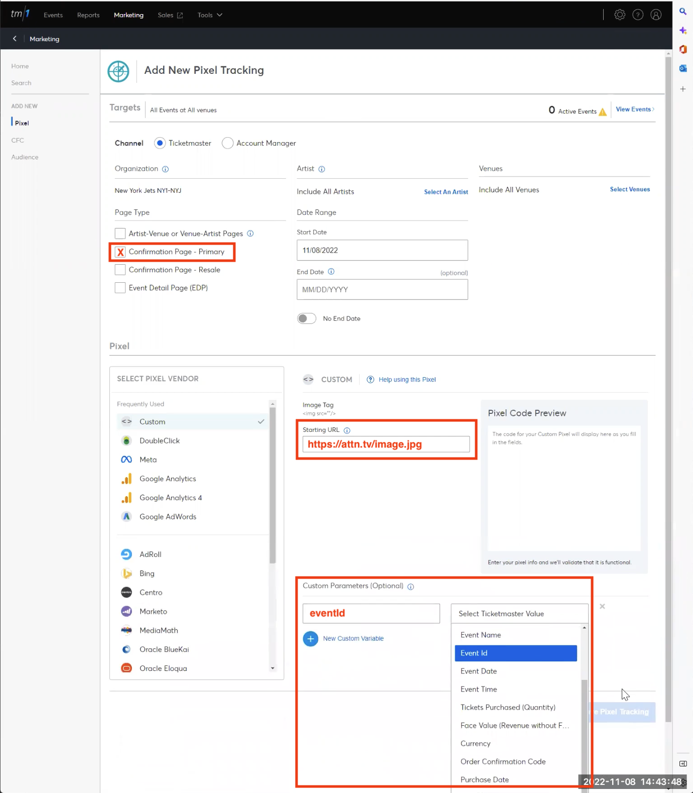

# Attentive Ticketmaster Proxy
 
Proxy server that receives GET requests at `/ticketmaster`, transforms the query params into data object properties and reroutes the request to Attentive Custom Events API server at `https://api.attentivemobile.com/v1/events/custom` as an authenticated POST request.

## Installation

Requires Node.js. To install dependencies type:

```shell
npm install
```

## Configuration

Add your Attentive API Key as a Bearer token to the `AUTH` environment varialbe in the  `.env` file. For example:

```
AUTH="Bearer <API KEY>"
```

Replace the placeholder phone number with your mobile phone number in E.164 format in the `document.cookie` script in the header of the index.html file. NOTE: Your mobile phone number must be subscribed to receive marketing texts for the Attentive account you are using.

```javascript
  <script>
    document.cookie = "phone=+12065551234"
  </script>
```

## Run the server

To run the server type:

```shell
npm start
```

## Run the client

- Open the index.html file on localhost using Live Server VS Code Extension or similar. 
- The client will plant a`phone` coookie associated with localhost.
- The client will make a GET request to your server on localhost:4000 to fetch a non-existent image. The image URL has a number of query params that identify the transaction.

```html

```
- Along with the params in the URL, the `phone` cookie will be passed to the server on localhost.
- The server will parse the request and make a POST request to the Attentive Custom Event API with the associated properties. NOTE: You could also make requests to the eCommerce Event API or the Custom Attributes API as necessary.

## Ticketmaster params

Many companies use Ticketmaster to sell tickets to events and want to track the source of a ticket referral for attribution. Ticketmaster does not allow you to add third-party javascript tags but it does allow you to perform *pixel tracking* by including an `img` tag that performs a GET request with custom parameters attached. A cookie for identifying the subscriber can be set by the `attn.tv` domain during the sign-up process and this cookie would be sent by the browser when fetching an image from the `attn.tv` domain. This cookie and the params can be used to extract event data and properties and rerouted to the Attentive API as an authenticated POST request.



## Flow

An `__attentive_id` cookie is created by the `attn.tv` domain during the sign-up unit process. When `ticketmaster.com` fetches an image from the `attn.tv` domain the cookies belonging to that domain will be passed in the header of the GET request. The `attn.tv` server can inspect the cookie to determine the user and transform the request into a Custom Events API request.


## curl examples

For example, when fetching an image from ticketmaster.com from attn.tv, the GET request could be constructed like this:

```shell
curl 'https://attn.tv/image.jpg?type=Tickets%20Purchased&eventId=123456&amount=$499&eventName=Taylor%20Swift%20Concert' \
-b "phone=+12065551234"
```

<!-- 
curl 'localhost:4000/ticketmaster/abcdef?apiKey=xyz456&type=Ticket%20Purchase&eventId=abc123&amount=$499' \
-b "__attentive_id=def789" 
-->


That attn.tv site woud parse the GET request and transform it into an Attentive Custom Events POST request like this:

```shell
curl -i -X POST \
  https://api.attentivemobile.com/v1/events/custom \
  -H 'Authorization: Bearer xyz456' \
  -H 'Content-Type: application/json' \
  -d '{
    "type": "Ticket Purchase",
    "user": {
      "phone": "+12065551234",
    }
    "properties": {
      "eventId": "abc123",
      "eventName": "Taylor Swift Concert",
      "amount": "$499"
    }
  }'
```